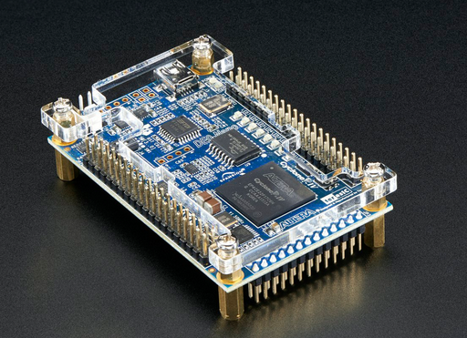

# de0_nano_msp430
This project is based on **openMSP430** open soft processor project by **Olivier Girard**.

This has been tested with

**Linux Distro:** Ubuntu 18.04.2 LTS

**Quartus Version:** Quartus prime lite edition 18.1

**Compiler** msp430-gcc-7.3.1.24

**Eclipse IDE for C/C++ Developers**

Version: 2018-12 (4.10.0)
Build id: 20181214-0600

The following packages are necessary

build-essentials

openocd

icarus verilog (iverilog)

tk

gdb-msp430

